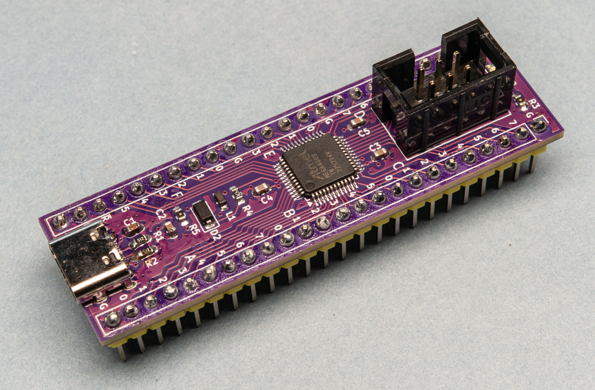
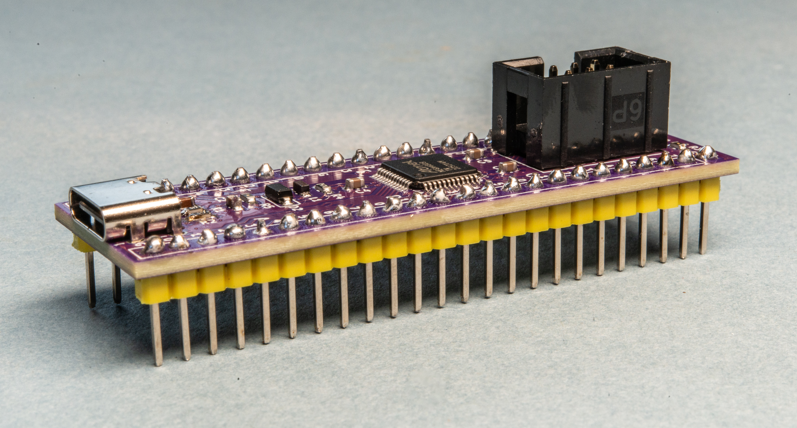

# ATmega4809-A-breakout

A breakout board that allows you to easily work with the AVR 0-series ATmega4809-A microcontroller. This is a QFP format chip, so this board breaks out the pins to two rows of 2.54mm pitch headers, effectively turning it into a DIP package.

Headers are provided for programming the microcontroller via UPDI, either via a six-pin (3x2) connector compatible with the Atmel-ICE or via serial. The latter has a diode between the TX and RX pins.

A footprint is provided for a USB-C socket. This is used just for powering the board at 5V. Or you can power it via the header pins. (No reverse current protection is provided.)

The BOM and Centroid files contain all the details for the surface-mount components, but not the USB socket or header pins.

Details are available on _Machina Speculatrix_, published via [Medium](https://medium.com/machina-speculatrix/creating-a-dev-board-for-an-atmega-microcontroller-3f15ba0bddc5) and [Substack](https://mspeculatrix.substack.com/p/creating-a-dev-board-for-an-atmega) (subscriptions required).

My intention is to use the board at 5V, but you can try 3.3V if you like.

 The board with added header pins.

The pins are labelled on front and back. The labelling on the front is abbreviated because of limited space. The symbols include:

- `V` - VCC
- `G` - GND
- `U` - UDPI
- `/R` - PF6 (RESET)

AVCC is connected to VCC (via an inductor). Sorry about that, analogue fans, but I ran out of pins.

Gerber files (Zip file), a Bill of Materials (BOM) and a pick-and-place (Centroid) file are available in the Documentation folder. The board is also be available for ordering (bare or with all surface-mount components) via PCBWay's '[Shared Projects](https://www.pcbway.com/project/shareproject/ATmega4809_A_Breakout_Board_2e8bc4c2.html)' platform.

Open source under the CC-CA-NC-SA-4.0 licence.

Offered as-is with absolutely no warrantees, guarantees or other 'tees. Use at your discretion and risk.
