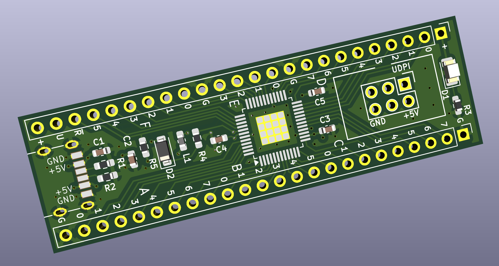
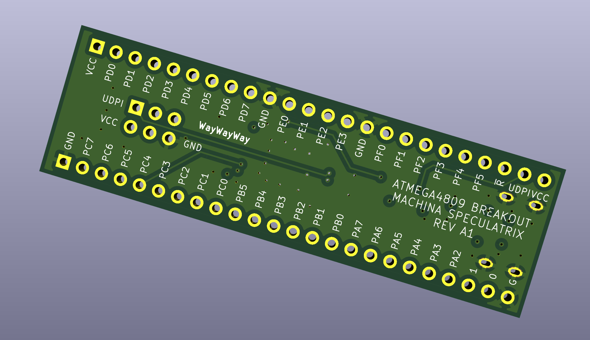

# ATmega4809-A-breakout

48-pin DIP breakout board for the Microchip ATmega4809-A microcontroller.

 Kicad render - front.

Kicad render - back.

AVCC is connected to VCC (via an inductor). Sorry about that, analogue fans, but I ran out of pins.

Open source under the CC-CA-NC-SA-4.0 licence.

Offered as-is with absolutely no warrantees, guarantees or other 'tees. Use at your discretion.
